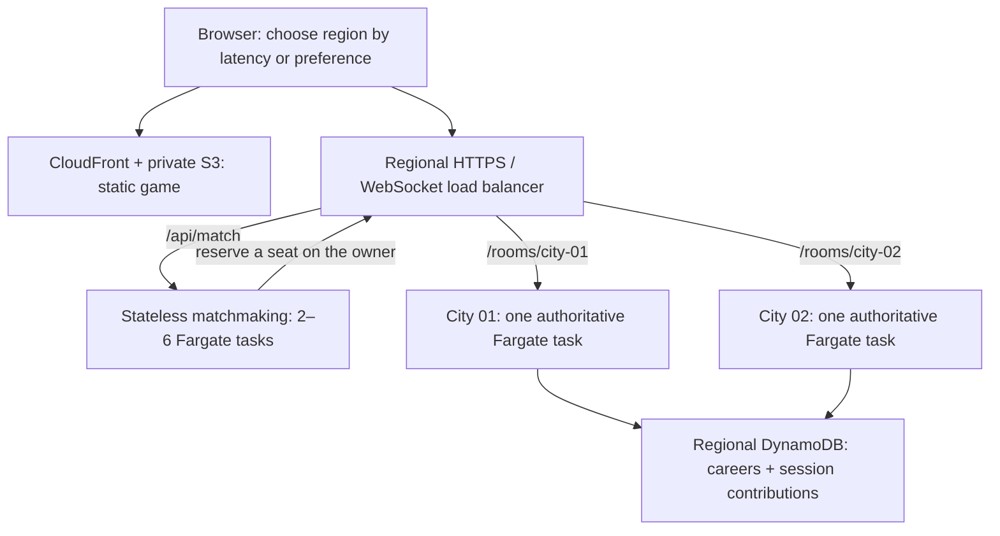

# Ad-hoc AWS regional-production deployment

AWS `regional-production` is an explicitly selected, ad-hoc deployment route. [Legacy Vercel + Deno](deno-deployment.md) remains the default. Both run the same game code with separate routing and persistence; publishing AWS does not change or retire the legacy deployment.

All three AWS workflows are manual (`workflow_dispatch`), with no push, merge, schedule, or automatic promotion trigger. CI may validate AWS code and Terraform on normal changes, but it never deploys AWS or needs AWS credentials. These files do not mean AWS is already live.

## Explicit target selection

| Component   | Default                                                 | AWS opt-in                                                                                                  |
| ----------- | ------------------------------------------------------- | ----------------------------------------------------------------------------------------------------------- |
| Frontend    | `VITE_DEPLOY_TARGET=legacy`; Vercel pins this value     | `bun run build:client:regional` sets `VITE_DEPLOY_TARGET=regional-production`; requires `VITE_REGIONS_JSON` |
| Backend     | `DEPLOY_TARGET=legacy`; Deno entrypoint pins this value | Terraform sets `DEPLOY_TARGET=regional-production` on both city and matchmaker tasks                        |
| Publication | Existing Vercel/Deno `main` Git integrations            | Dispatch the AWS workflows manually                                                                         |

Setting only a region directory or AWS database name never enables regional mode. An explicit AWS build with missing or invalid regional settings fails before publication. Legacy builds ignore the AWS directory, including malformed leftover values.

For manual workflows, use the branch selector (or `gh workflow run release.yml --ref codex/regional-production`). Supported branches are `main`, `regional-production`, and `codex/regional-production`. The workflow files must first be present on the default branch for normal manual dispatch; see [GitHub's manual workflow instructions](https://docs.github.com/en/actions/how-tos/manage-workflow-runs/manually-run-a-workflow). Selecting a regional branch does not change the legacy production branch.

## Regional architecture



Each region has an independent Terraform state, VPC, ALB, ECS cluster, signing key, and DynamoDB table. A region outage does not require another region's database or game loop. Image pulls use the bootstrap region's ECR repository; replicate ECR and change image URIs before requiring deployment independence from that region.

Players choose a region or use the initial HTTP latency measurement. The matchmaker only considers that region's configured cities, preferring populated cities with space. The owner reserves a seat synchronously for 15 seconds and binds its single-use ticket to a browser-generated random session ID. A signed guest credential identifies the saved career independently of nickname. Reservations require a server-only RPC key; guests cannot directly allocate city seats. Connected players, disconnected players in the 30-second grace window, and pending reservations all count toward capacity.

Every city has an explicit ALB path and exactly one task. Never increase a city's ECS desired count: doing so splits its world into conflicting instances. Scale with additional `room_ids`, then additional regions. The initial configuration has two cities with 64 human seats each, plus eight bots per city. These are conservative configuration defaults, not measured production capacity. Matchmaking tasks can autoscale independently between two and six instances.

The simulation stays in memory at 20 Hz. DynamoDB receives retry-safe cumulative checkpoints every 30 seconds and at exit. Transactions compare revisions and apply only the change since a session's last contribution, including score decreases from penalties. Session contribution records do not expire; deleting them makes old retries unsafe. Careers and leaderboards are regional. Existing name-based Deno/MongoDB records are preserved separately and are not silently assigned to new guests. Clearing browser storage loses the guest credential; cross-device recovery and global careers need account authentication in a later release.

## Prerequisites and costs

Use a dedicated AWS workload account with billing alerts, an operator SSO profile, AWS CLI v2, Terraform 1.13.3, and a Route 53 hosted zone you control. Supply the intended launch regions, API domain per region, allowed frontend origin, and an alert recipient. Terraform examples use placeholder values for Singapore and Ireland; replace them before planning.

The stack is paid infrastructure: each region runs an ALB, at least four Fargate tasks, two public subnets, WAF, logs/metrics, Secrets Manager, and on-demand DynamoDB. Public task addresses avoid NAT gateways; security groups allow inbound game traffic only from the ALB. DynamoDB uses a VPC gateway endpoint. Tasks have no direct public game ingress. Use the AWS Pricing Calculator with the selected regions and expected bandwidth before launch. No cost or 100k-concurrency claim has been validated.

## Bootstrap once

1. Authenticate with the operator's AWS SSO profile and verify `aws sts get-caller-identity`.
2. Run `terraform -chdir=infra/bootstrap init`, then `terraform -chdir=infra/bootstrap plan` and `terraform -chdir=infra/bootstrap apply`. Set `existing_oidc_provider_arn` if the account already has GitHub's provider. Review the infrastructure role: resource creation requires broad service permissions; restrict it further with account SCPs or a permissions boundary for a shared account.
3. Securely retain the bootstrap state. It initially uses local state to avoid a circular dependency on its own bucket. Move it to the created encrypted, versioned bucket by adding an S3 backend in a local `backend.tf` and running `init -migrate-state`; use key `bootstrap/terraform.tfstate`, the bootstrap AWS region, `encrypt=true`, and `use_lockfile=true`. Keep the backend configuration with your deployment configuration. Regional workflow roles cannot access the `bootstrap/` prefix.
4. Record the Terraform outputs: state bucket, ECR repository, both GitHub role ARNs, frontend bucket, CloudFront distribution ID, and frontend URL.
5. Create a separate signing key in each region and environment:

   ```bash
   python3 scripts/create-guest-secret.py --region ap-southeast-1 --environment production
   ```

   The script prints only the secret ARN. Repeating it fails instead of rotating an existing key. Store this ARN in deployment configuration; never store the secret value in GitHub variables or Terraform state. Back up your key according to your account's secret recovery policy. Rotation requires a credential migration or it invalidates existing guests.

6. Copy an example from `infra/examples` into a local, ignored `.tfvars` file. Set real domains, hosted zone ID, frontend URL, secret ARN, and alert email. Use separate API domains and keys for staging and production. Advertise only regions you intend to deploy. AWS emails the alarm recipient to confirm the SNS subscription; alerts do not reach them until confirmed.

## GitHub configuration

Create `release`, `infra-staging`, and `infra-production` environments. Restrict them to the approved AWS source branches (`main`, `regional-production`, and/or `codex/regional-production`), require production reviewers, and disable self-review where appropriate. Protect `main` with the CI checks. GitHub OIDC trust is scoped to this repository and those environments; no long-lived AWS access keys are needed. The infrastructure role can create runtime roles, so protect workflow and infrastructure changes with code ownership and branch rules.

Set these environment variables (configuration values, not GitHub secrets):

| Environment                          | Variables                                                                                                                  |
| ------------------------------------ | -------------------------------------------------------------------------------------------------------------------------- |
| `release`                            | `PUBLISHER_ROLE_ARN`, `ARTIFACT_REGION`, `ECR_REPOSITORY`, `FRONTEND_BUCKET`, `CLOUDFRONT_DISTRIBUTION_ID`, `REGIONS_JSON` |
| `infra-staging` / `infra-production` | `INFRASTRUCTURE_ROLE_ARN`, `ARTIFACT_REGION`, `STATE_BUCKET`, `REGION_CONFIGS_JSON`                                        |

`REGIONS_JSON` is an array such as `[{"id":"ap-southeast-1","label":"Singapore","apiUrl":"https://sg.play.your-domain.com"}]`.

`REGION_CONFIGS_JSON` maps each AWS region to the variables in `infra/region/variables.tf`, excluding `image` and `release_sha`. Include `region`, `environment`, `hosted_zone_id`, `api_domain`, `allowed_origins`, `guest_secret_arn`, `alarm_email`, `room_ids`, `room_capacity`, and `regions`. The workflow rejects mismatched environment/region keys. All production directory entries must agree with the release's `REGIONS_JSON`; staging may use its own endpoints. Never put plaintext credentials in this object.

## Build, stage, promote

1. Review the source branch and pass CI. Register the workflow files on `main` once; later ad-hoc runs may use an approved regional branch. CI covers shared/server tests, builds, Deno compatibility, existing browser flows, regional browser flows, actual gateway/two-city matching, Terraform validation and architecture assertions, and container startup.
2. Dispatch **AWS regional-production - Build release** from the chosen approved branch. It reruns checks, pushes an immutable ECR image and records its digest, Git revision, region directory, and compiled frontend in a retained GitHub artifact. A unique immutable tag allows rerunning the same revision. The workflow does not publish the frontend yet.
3. Dispatch **AWS regional-production - Deploy infrastructure** with the release run ID, its exact digest and revision, a staging region, and `apply=false`. Inspect the plan in the logs. Repeat with `apply=true` after reviewing the intended changes. Environment reviewers control application. The workflow verifies the `regional-production` target and supplied digest/revision against the successful release artifact and uses encrypted state with S3 locking.
4. Run the same process for one production region at a time. Apply uses `-parallelism=1` and waits for ECS stability. Automated smoke checks verify every city's deployed revision, database health, and regional identity, then exercise matching, binary snapshots, and a same-city reconnect. A rollback by the ECS circuit breaker fails the expected-revision check rather than being mistaken for success.
5. Exercise two actual browsers in staging, deliver a passenger, verify the regional saved leaderboard, and inspect logs. Load-test before expanding capacity. Include room restarts, storage denial, ticket expiry, a full region, and a mobile connection interruption in launch testing.
6. Dispatch **AWS regional-production - Publish frontend** using that successful release run ID. It checks every advertised region against the release revision before publishing. Hashed assets upload first; `index.html` uploads last with no-cache headers. Old assets remain so existing pages continue working. CloudFront invalidation refreshes the entrypoint.

The default CloudFront hostname serves the separate AWS site. The default public game remains on Vercel. A branded frontend domain can be added with an ACM certificate in `us-east-1`, a CloudFront alias, and Route 53 records. API domains and TLS certificates are managed in the regional stacks already. Keep the legacy Vercel project, Deno app, domains, and Git integrations in place. The AWS workflows publish only their own ECR, ECS, S3, and CloudFront resources.

## Rollbacks, restarts, and capacity

A city replacement ends its live ride. The old task is deregistered for 30 seconds and then receives SIGTERM; the server stops accepting players, checkpoints, closes sockets, and exits within its 30-second stop timeout. Singleton deployment settings prevent two owners of a path. New matches use another available city during replacement. The client retries its original city for up to 25 seconds and then returns to the lobby; it never silently transfers a live ride to another region. An abrupt crash can lose progress since the last successful checkpoint, and a prolonged database outage can lose more. Saved careers survive task replacement; live positions and carried passengers do not.

Rollback a region through **AWS regional-production - Deploy infrastructure** using the earlier successful release run ID, digest, and revision. It applies the earlier image to the current infrastructure configuration. To roll back infrastructure itself, revert its source and review the resulting Terraform plan; do not restore old state files as a deployment technique. Publish the matching previous frontend artifact after the region checks pass. Keep rollback artifacts beyond the default 90-day retention if required. ECR images are not automatically deleted.

Add city IDs instead of increasing desired counts. Removing a city is disruptive and should happen in a maintenance window; this release does not automatically drain a specific city for scale-in. Health failures and deployment rollbacks have alarms. Seat occupancy above 80%, city CPU above 70%, or a tick budget above 40 ms trigger capacity investigation. The game emits occupied seats, maximum tick work, and maximum scheduling lag every five seconds. Database write failures produce a separate alarm. Ensure the SNS subscription is confirmed and test alert delivery.

WAF limits `/api/` requests per source IP; signed internal room reservations use `/rooms/` paths and do not share the matchmaker's public-IP rate bucket. Tune the limit for shared networks and load tests. Message rate, payload size, join timeout, heartbeat, send-buffer limits, and session admission remain enforced by the game server. This is a launch baseline, not a claim of comprehensive DDoS protection.

## Local verification and limits

```bash
bun install --frozen-lockfile
bun run test
bun run build:legacy
bun run test:legacy
bun run test:regional
bun run test:e2e
bun run test:e2e:regional
bun run lint
terraform -chdir=infra/bootstrap init -backend=false
terraform -chdir=infra/bootstrap validate
terraform -chdir=infra/region init -backend=false
terraform -chdir=infra/region validate
terraform -chdir=infra/region test
```

The Terraform architecture test uses mocked AWS responses and creates no resources. DynamoDB transaction unit tests verify retries, duplicate checkpoints, penalties, and concurrent careers with a conditional-write test double; staging must still verify the actual AWS service and IAM policies. Browser region tests mock the match API; the separate regional smoke test runs the actual gateway and two game processes. Local MongoDB and Deno KV remain the legacy defaults. The legacy runtime smoke test runs the actual Deno entrypoint with local KV while stale AWS settings are present.

Verification in this checkout on 2 October 2026 passed shared/server unit tests, both Deno KV tests, 11 browser flows, actual two-city routing and reconnect checks, Terraform validation and the mocked architecture plan, workflow lint, and container build/startup. The container ran as UID 1000 with a read-only filesystem and no Linux capabilities. A 15-second local Docker check kept 64 clients connected with no drops (observed ping p95: 128 ms); it is not an AWS capacity benchmark. No AWS resources were provisioned or live AWS/IAM checks performed.

References: [ECS deployment limits](https://docs.aws.amazon.com/AmazonECS/latest/developerguide/service_definition_parameters.html), [ALB draining](https://docs.aws.amazon.com/AmazonECS/latest/developerguide/load-balancer-connection-draining.html), [DynamoDB transactions](https://docs.aws.amazon.com/amazondynamodb/latest/developerguide/transaction-apis.html), and [GitHub OIDC on AWS](https://docs.github.com/en/actions/how-tos/secure-your-work/security-harden-deployments/oidc-in-aws).
